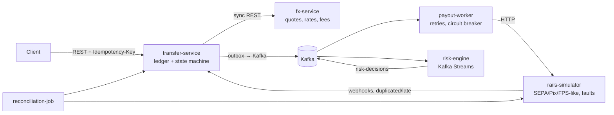

# Architecture

## Target system

| Component | Problem it demonstrates | Milestone |
|-----------|------------------------|-----------|
| transfer-service | Money correctness (double-entry), idempotent APIs, state machines, concurrency control, dual-write problem | M1–M4 |
| fx-service | Caching, time-bounded quotes, BigDecimal rounding, degraded mode when a dependency is down | M5 |
| rails-simulator | Unreliable external systems: timeouts, failures, duplicate and late callbacks | M6 |
| payout-worker | Retries without double payouts, circuit breaking, unknown outcomes | M6 |
| reconciliation-job | Detecting drift between internal records and the bank | M7 |
| observability stack | Tracing a transfer across HTTP and Kafka, SLOs | M8 |
| risk-engine | Stream processing with windows, an async step in a workflow | M9 |

## Current state (M0)
Only `transfer-service` exists, with a health endpoint, Flyway migrations, and a Testcontainers-backed integration test. Local infrastructure (Postgres, Kafka) runs via `docker-compose.yml`.
