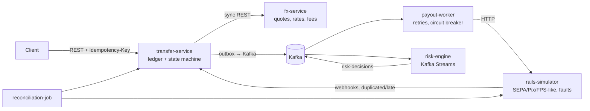
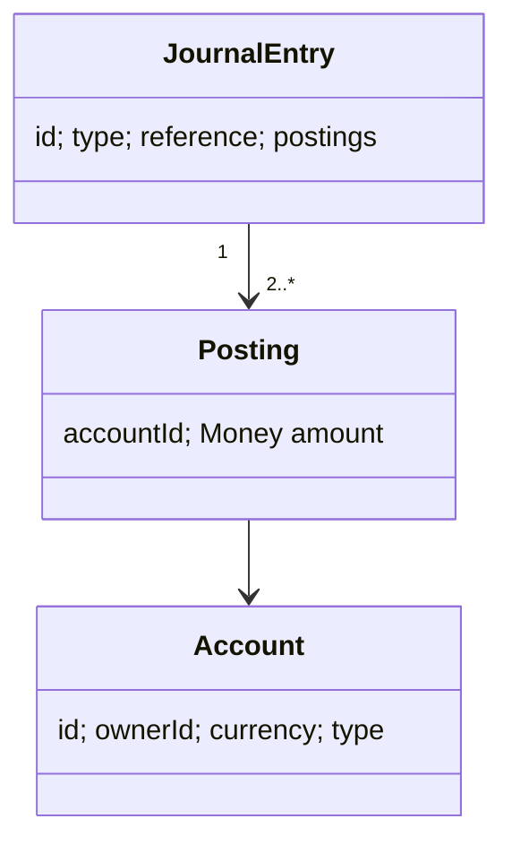
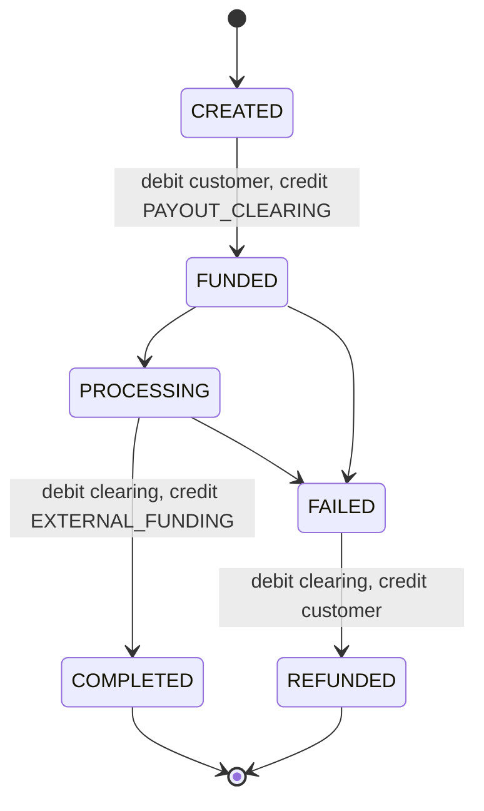

# Architecture

## Target system

| Component | Problem it demonstrates | Milestone |
|-----------|------------------------|-----------|
| transfer-service | Money correctness (double-entry), idempotent APIs, state machines, concurrency control, dual-write problem | M1–M4 |
| fx-service | Caching, time-bounded quotes, BigDecimal rounding, degraded mode when a dependency is down | M5 |
| rails-simulator | Unreliable external systems: timeouts, failures, duplicate and late callbacks | M6 |
| payout-worker | Retries without double payouts, circuit breaking, unknown outcomes | M6 |
| reconciliation-job | Detecting drift between internal records and the bank | M7 |
| observability stack | Tracing a transfer across HTTP and Kafka, SLOs | M8 |
| risk-engine | Stream processing with windows, an async step in a workflow | M9 |

## Current state (M5)
`transfer-service` contains the ledger core:

- `ledger` package: `Money`, `Account`, `JournalEntry`, `LedgerService` (the only code that moves money), `LedgerRepository` (SQL).
- REST: `POST /accounts`, `GET /accounts/{id}`, `GET /owners/{ownerId}/accounts`.
- Transfers (M2): `POST /transfers` (headers `X-Owner-Id`, `Idempotency-Key`), `GET /transfers/{id}`.
- Internal/simulation: `POST /internal/accounts/{id}/top-ups`, `POST /internal/transfers/{id}/processing|complete|fail`. In M6, the payout worker and bank webhooks replace these.

### M4: events
- `transfer-service` writes `TransferStateChanged` to `outbox_events` in the state-change transaction. `OutboxRelay` publishes to `transfers.events.v1` (key = transfer id, 3 partitions).
- `payout-worker` (own DB `payouts`) consumes the topic and records one `PENDING` payout per FUNDED transfer, idempotently. Bad records go to `transfers.events.v1.DLT`.
- The shared contract lives in `libs/events` (plain Java records, no framework).

### M5: fx-service
- `POST /quotes`, `GET /quotes/{id}`, `POST /quotes/{id}/consume` (port 8082, DB `fx`). ECB rates are held in memory and refreshed every 10 min. It fails closed after 1 h without a successful refresh.
- Not wired into transfer-service yet (TODO): same-currency transfers only so far.
