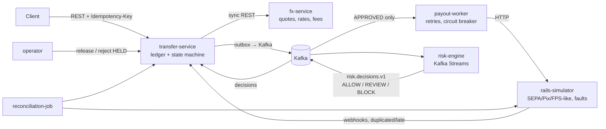
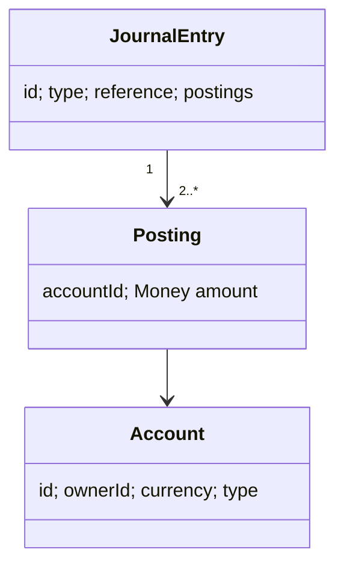
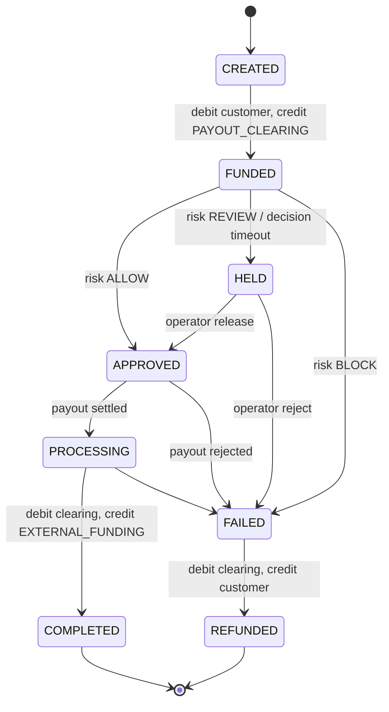
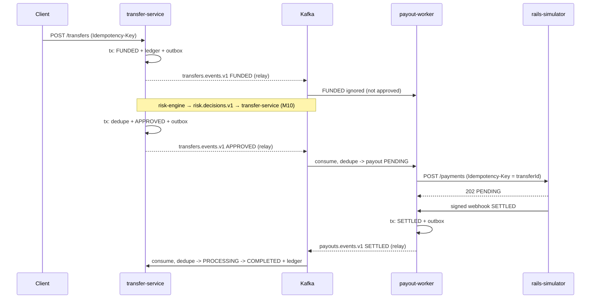

# Architecture

## Target system

| Component | Problem it demonstrates | Milestone |
|-----------|------------------------|-----------|
| transfer-service | Money correctness (double-entry), idempotent APIs, state machines, concurrency control, dual-write problem | M1–M4 |
| fx-service | Caching, time-bounded quotes, BigDecimal rounding, degraded mode when a dependency is down | M5 |
| rails-simulator | Unreliable external systems: timeouts, failures, duplicate and late callbacks | M6 |
| payout-worker | Retries without double payouts, circuit breaking, unknown outcomes | M6 |
| reconciliation-job | Detecting drift between internal records and the bank | M7 |
| observability stack | Tracing a transfer across HTTP and Kafka, SLOs | M8 |
| risk-engine | Stream processing with windows, an async step in a workflow | M9 |
| risk gate (HELD) | Ordering an async decision before an irreversible external effect; fail-closed; idempotent manual decisions | M10 |

## Current state (M10)
`transfer-service` contains the ledger core:

- `ledger` package: `Money`, `Account`, `JournalEntry`, `LedgerService` (the only code that moves money), `LedgerRepository` (SQL).
- REST: `POST /accounts`, `GET /accounts/{id}`, `GET /owners/{ownerId}/accounts`.
- Transfers (M2): `POST /transfers` (headers `X-Owner-Id`, `Idempotency-Key`), `GET /transfers/{id}`.
- Internal/simulation: `POST /internal/accounts/{id}/top-ups`, `POST /internal/transfers/{id}/processing|complete|fail`. In M6, the payout worker and bank webhooks replace these.
- Risk (M10): `POST /internal/transfers/{id}/release|reject` (header `X-Operator`), `GET /internal/transfers/{id}/risk-decisions`.
- Only APPROVED creates a payout. FUNDED, HELD and APPROVED keep money in PAYOUT_CLEARING.

### M4: events
- `transfer-service` writes `TransferStateChanged` to `outbox_events` in the state-change transaction. `OutboxRelay` publishes to `transfers.events.v1` (key = transfer id, 3 partitions).
- `payout-worker` (own DB `payouts`) consumes the topic and records one `PENDING` payout per FUNDED transfer, idempotently. Bad records go to `transfers.events.v1.DLT`.
- The shared contract lives in `libs/events` (plain Java records, no framework).

### M5: fx-service
- `POST /quotes`, `GET /quotes/{id}`, `POST /quotes/{id}/consume` (port 8082, DB `fx`). ECB rates are held in memory and refreshed every 10 min. It fails closed after 1 h without a successful refresh.
- Not wired into transfer-service yet (TODO): same-currency transfers only so far.

### M6: payouts
- `rails-simulator` (port 8083, in-memory): idempotent `POST /payments`, signed webhooks, fault injection via `POST /admin/faults`.
- `payout-worker` dispatcher: lease-based claiming, idempotent submission, response classification, backoff, circuit breaker, `POST /rails/callbacks`.
- `libs/rails-api`: the rail contract + HMAC signing.

### End-to-end flow (M6)

The outbox is shared code (`libs/outbox`); each service owns its own `outbox_events` table.

### M7: reconciliation-job (port 8084)
Nightly (and `POST /reconciliation/runs`): ledger self-checks in one REPEATABLE READ snapshot + matching against payouts and the rail statement. Breaks stored in its own `recon` DB. Read-only access to the other databases (ADR 0014).

### M8: observability
Every service: `/actuator/prometheus` + OTLP traces (Kafka headers carry `traceparent`). `docker compose --profile observability up -d` → Prometheus :9090 (alerts in `infra/prometheus/alerts.yml`), Grafana :3000 (dashboard "wise-lite: money movement"), Jaeger :16686. ADR 0015.

### M9: risk-engine (port 8085)
Kafka Streams over `transfers.events.v1` (FUNDED, deduped by eventId, event time) → VELOCITY / DAILY_VOLUME / MULE_RECIPIENT → `risk.alerts.v1`. Detection only (ADR 0016).

### M10: risk gating (ADR 0017)
risk-engine also emits one `RiskDecision` per FUNDED transfer (`risk.decisions.v1`, repartitioned by owner, deterministic id). transfer-service applies it only while the transfer is FUNDED (ALLOW → APPROVED, REVIEW → HELD, BLOCK → FAILED → REFUNDED); everything else is recorded as IGNORED in `risk_decisions`. No decision within `wiselite.risk.decision-timeout` → HELD (fail closed). Operators release/reject HELD transfers idempotently. payout-worker creates payouts only for `APPROVED`. Reconciliation flags `PAID_BEFORE_APPROVAL`. Details: `docs/interview/risk-gating.md`.
