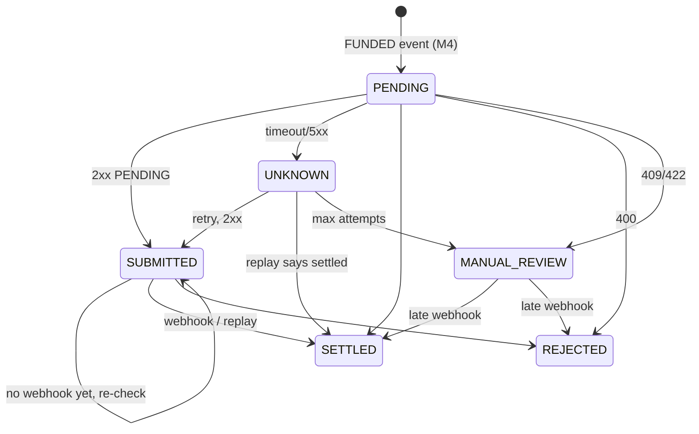

# Payouts: retries, unknown outcomes, webhooks, circuit breaking (M6)

Code: `payout-worker/.../PayoutDispatcher`, `PayoutStore`, `RailsClient`, `CallbackService`, `CircuitBreaker`, `Backoff`. `rails-simulator` (fault injection). Tests: `PayoutDispatchIT`, `CircuitBreakerTest`, `BackoffTest`, `RailsSimulatorIT`.

## 1. The one idea to own: the unknown outcome
```
worker ──POST /payments──▶ rail      (rail moves the money)
worker ◀──── timeout ─────  rail      (response lost)
```
Did the money move? **You can't know.** Wrong answers:
- "Mark it failed": the customer gets refunded *and* the recipient gets paid. We lose money.
- "Retry blindly": without an idempotency key, the recipient is paid twice.

The right answer is to retry with the **same idempotency key** (or query the status), and never auto-fail. Proven by `unknownOutcomeIsResolvedByRetryingWithTheSameIdempotencyKey` (the fake rail answers 500 *after* processing).

## 2. State machine


## 3. Things to be able to explain
1. **Why no transaction across the HTTP call:** it would hold row locks and a pool connection for seconds; the pool runs out under rail latency. The lease plus conditional updates replace it.
2. **Lease vs lock:** a lease expires on its own if the worker dies. A crashed worker's payout gets picked up again after `lease` (and that is safe because of the idempotency key).
3. **Webhook vs response race:** both paths update conditionally on a non-final status. The first final result wins, and the later one becomes a no-op.
4. **Webhook security:** HMAC over the raw bytes (not over re-serialised JSON), constant-time comparison, plus a secret shared out of band. Replay protection = `eventId` dedupe. Production also adds a timestamp in the signature and a tolerance window.
5. **Retries:** exponential backoff + jitter. Why jitter: synchronized retries after an outage cause a thundering herd. Retry only what is retryable: 400 is permanent, 503 is not.
6. **Circuit breaker:** CLOSED → OPEN after N consecutive failures → HALF_OPEN after a cool-down → one trial. Why: failing fast protects the rail and our own threads and connections, and gives the rail room to recover. Why only `Unknown` counts as a failure: a 400 means the rail is healthy.
7. **Why MANUAL_REVIEW instead of FAILED:** correctness beats automation when money may have moved. Reconciliation (M7) will resolve most of these automatically from the rail's statement.

## 4. Likely questions
- "What if the worker crashes after the rail accepted, before we stored SUBMITTED?" → The lease expires, we re-submit with the same key, and the rail returns the existing payment.
- "What if the rail doesn't support idempotency keys?" → Query by our reference before every retry. If the rail can't do that either, you need a statement-based reconciliation (M7) and manual handling.
- "How do you scale the dispatcher?" → Many instances: SKIP LOCKED + leases make them cooperate. Add one breaker per rail.
- "How would you alert?" → On the age of the oldest UNKNOWN/MANUAL_REVIEW, on breaker open, and on the webhook signature failure rate.

## 5. Rebuild exercise
1. Delete `Idempotency-Key` in `RailsClient`, add an idempotency check to the fake rail, and watch the unknown-outcome test pay twice.
2. Re-implement `CircuitBreaker` from the description in §3.6 against `CircuitBreakerTest`.
3. Wrap `dispatchDue` in `@Transactional` and explain what breaks under a 2 s rail latency with a pool of 10 connections.
