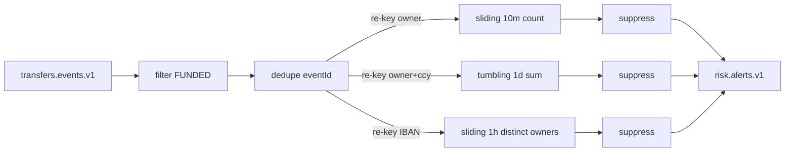

# Risk engine: Kafka Streams (M9)

Code: `services/risk-engine`:
- `RiskTopology` — the whole dataflow;
- `FirstSeen` — dedupe and alert suppression;
- `OccurredAtTimestampExtractor`;
- `RiskStreams` — lifecycle, topic bootstrap, health, metrics.

Tests:
- `RiskTopologyTest` — TopologyTestDriver, no broker, deterministic time;
- `RiskEngineIT` — real Kafka, `exactly_once_v2`, `read_committed` consumer.

## 1. Things to be able to explain
1. **Event time vs processing time.** Why `occurredAt` is used (outbox backlog after an outage), and what "stream time" is: the max timestamp seen so far, per task.
2. **Window types:**
   - tumbling: fixed, non-overlapping (daily limits);
   - hopping: fixed, overlapping;
   - sliding: defined by the time difference between records ("any 10 minutes");
   - session: separated by gaps of inactivity.
3. **Grace and late data:** a window accepts records until window end + grace (in stream time). After that they are dropped. The trade-off is result latency and state size vs completeness.
4. **Exactly-once semantics in Kafka Streams:**
   - consumer offsets, state-store changelogs and output records are committed in one Kafka transaction;
   - consumers must read with `read_committed`, otherwise they can see aborted output;
   - it does *not* dedupe upstream duplicates, and it does not cover external side effects (HTTP, DB). Hence `FirstSeen`.
5. **Repartitioning:** grouping by a new key writes the records to an internal `-repartition` topic, so all records of that key reach one task. Each re-key costs network, storage and latency.
6. **State and recovery:**
   - RocksDB holds the state locally, and a changelog topic backs it up;
   - after a crash or rebalance the task restores the store from the changelog;
   - standby replicas make failover faster.
7. **Bounded state:** windows with retention, capped id lists. An unbounded `distinct` set is a memory leak.
8. **Detect vs prevent:** async alerts do not stop money already funded. A sync pre-check adds hot-path latency and needs a fail-open/closed decision.

## 2. Likely questions
- "A user makes 6 transfers but the outbox publishes 12 events — false alert?" No: the dedupe by eventId runs before the count. Then: "why is a partition-local store enough?" Because duplicates share the key, so they land on the same partition.
- "Why not just a SQL query every minute?" It polls the OLTP database, and correct sliding windows in SQL are expensive. Streams does it incrementally.
- "How would you scale?" More partitions means more tasks. State is sharded by key. The hot keys are system-level (big merchants).
- "What happens if risk-engine is down for an hour?" It resumes from the committed offsets and processes the backlog in event time, so the windows stay correct within the grace period. Events later than the grace period are dropped from window results (visible in the dropped-records metric).

## 3. Exercises
1. Add a `HELD` transfer state: transfer-service consumes `risk.alerts.v1` and holds the payout if it hasn't been dispatched yet.
2. Normalise `DAILY_VOLUME` to EUR using fx-service rates (a GlobalKTable of rates).
3. Replace `FirstSeen` alert suppression with `suppress(untilWindowCloses)` and compare latency vs alert count.
4. Add a session-window rule: "a new recipient plus a large amount within 5 minutes of account creation".
