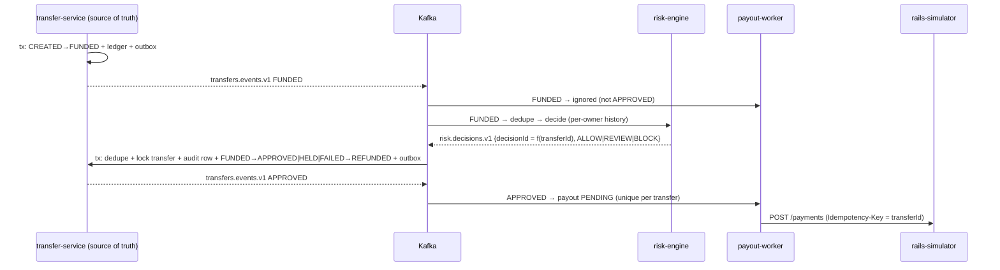

# Risk gating: HELD transfers, decision ordering, fail-closed (M10)

Code: `services/transfer-service/.../risk/*`, `TransferState`, `services/payout-worker/.../PayoutService`,
`services/risk-engine/.../{RiskPolicy,DecisionProcessor}`. ADR 0017.
Tests: `RiskGateIT`, `TransferStateTest`, `PayoutWorkerIT.unapprovedTransfersNeverGetAPayout`,
`RiskDecisionTopologyTest`, `ReconcilerTest.railPaymentForAnUnapprovedTransfer…`, `RiskGateSystemTest`.

## 1. The problem: asynchronous risk creates an ordering problem

In M9 one event (`FUNDED`) had two independent consumers: payout-worker ("pay it") and risk-engine
("is this suspicious?"). Kafka orders records within a partition, but **not across consumer groups**: each group
reads at its own pace. So the payout path could win, and usually would: it's simpler and has no windows.

Making risk "a gate" therefore isn't about adding a `HELD` enum value. You have to make sure no path exists on
which a payout becomes actionable before approval.

## 2. Why "send the payout and cancel it if risk blocks" is unsafe

- The dispatcher may already have claimed the row and be mid-HTTP-call. A cancel then races a submit.
- After submission, the outcome can be **unknown** (timeout, 5xx after processing — M6). You cannot know
  whether there is something to cancel.
- Rails like SEPA Instant / Faster Payments settle in seconds and don't support recall reliably. A recall is a
  request to the recipient's bank, not an undo.
- Every cancel path is a new state space (cancel requested, cancel failed, cancel unknown…) that reconciliation
  would also have to understand.

So the design rule is: **an unapproved payout is never eligible for submission in the first place.**

## 3. What wise-lite does

- **Source of truth:** transfer-service's `transfers.state` (under row lock) plus the `risk_decisions` audit table.
  risk-engine is an *advisor*: it has an opinion; transfer-service decides what the opinion does. payout-worker
  doesn't know anything about risk; it just reacts to `APPROVED`.
- **The gate in code** is one line in `PayoutService.handle` (`APPROVED` only) plus the state machine
  (`PROCESSING` reachable only from `APPROVED`; `APPROVED` never goes back). Both are tested directly.

## 4. Duplicate and out-of-order decisions

| Situation | Why it's safe |
|---|---|
| Kafka redelivers a decision | Same `decisionId` → `processed_events` conflict → `DUPLICATE`, nothing runs |
| Decision re-emitted by risk-engine (crash, reprocessing) | Deterministic `decisionId` → same as above |
| Different decision for the same transfer (rules re-run, replay with new ids) | Transfer is no longer FUNDED → recorded `IGNORED` |
| Decision after timeout → HELD | Not FUNDED → `IGNORED`; operator sees it in `/internal/transfers/{id}/risk-decisions` |
| Decision after COMPLETED/REFUNDED | Not FUNDED → `IGNORED`; a terminal transfer can't be resurrected |
| Decision races timeout sweeper | Both take the row lock; the second sees not-FUNDED and backs off |
| Crash mid-processing | One transaction; nothing committed; record redelivered and applied once |

Notice we don't need sequence numbers: a decision answers a question that can only be asked in one state.

Ordering across topics: `APPROVED` is emitted by transfer-service *after* it committed the decision, on the
transfer's key. payout-worker can't see `APPROVED` before it exists, so cross-topic ordering never matters.

## 5. Fail-open vs fail-closed

- **Fail open** (no answer → ALLOW): best availability, but a risk-engine outage (or a poisoned consumer)
  becomes a free window for fraud. For money movement it's the wrong default.
- **Fail closed to BLOCK** (no answer → refund): safe but customer-hostile; a 10-minute outage cancels
  thousands of good transfers, and retries double the load.
- **wise-lite: fail closed to HELD.** After `decision-timeout` the sweeper moves FUNDED → HELD with reason
  `RISK_TIMEOUT`. The money stays reserved, nothing moves, an operator decides. A late engine decision is recorded,
  not applied (keeps HELD with a single exit, the operator).
- Subtlety: the timeout must exceed **our own** recovery time. After transfer-service crashes, decisions queue in
  Kafka; the group needs up to `session.timeout.ms` to give partitions to the new instance. So the first sweep waits
  one full timeout after startup, and the system test uses a 60 s timeout.

## 6. Idempotent manual release / reject

`RiskOperatorService` under `SELECT … FOR UPDATE` on the transfer:

- HELD + release → `APPROVED` (one outbox event → one payout); HELD + reject → `FAILED → REFUNDED` (one refund journal).
- Not HELD, and this same verdict was already applied by an operator → return current state (a retry: 200).
- Otherwise → 409 (release after reject, reject after release, release on FUNDED, reject on APPROVED).
- No Idempotency-Key needed: the state *is* the idempotency record, because each verdict can only happen once.
- Backstop: unique partial index `one_applied_decision_per_source (transfer_id, source) WHERE outcome='APPLIED'`.
- Note what reject on APPROVED means: the payout may be at the rail, so there's no "cancel" button. That case
  belongs to reconciliation/recall, not to risk.

## 7. Outages

| Outage | Behaviour |
|---|---|
| risk-engine down | FUNDED piles up; after the timeout → HELD. No payout without approval. On restart, decisions for still-FUNDED transfers apply; others are recorded IGNORED. |
| Kafka down | Outbox buffers FUNDED events; no decisions; FUNDED → HELD after timeout (sweeper only needs Postgres). |
| transfer-service down | Decisions wait in Kafka; on restart applied in order; first sweep delayed by one timeout. |
| payout-worker down | APPROVED events wait in Kafka; on restart one payout per transfer (`ON CONFLICT (transfer_id)`). |
| Poison decision | Validation → IllegalArgumentException → DLT `risk.decisions.v1.DLT`; partition continues; that transfer times out to HELD. Fail closed again. |

## 8. At much larger scale

- **Decision latency budget:** with SEPA Instant you have seconds. Run hard checks (sanctions, blocklists)
  synchronously in the transfer path from an in-memory replica, and keep windowed/behavioural rules async.
  Many systems split "pre-funding screening" from "pre-payout gating".
- **Hot owners / merchants:** the per-owner state store becomes a hot partition; shard by (owner, bucket) and
  aggregate, or move to approximate counters.
- **State size:** owner history is pruned per owner but owners are never evicted; use a TTL'd/windowed store.
- **Decision service as a product:** versioned rules, shadow mode (evaluate new rules without enforcing), case
  management for HELD with SLAs and four-eyes approval for big amounts.
- **Re-screening:** decisions can change (sanctions list updated). That requires *revisable* decisions, i.e.
  versions on the decision and a gate that is checked again right before submission (payout-worker asks
  transfer-service "still approved?" under the payout lease) — a deliberate extension, not done here.
- **Timeout sweeper** with many instances: `FOR UPDATE SKIP LOCKED` batches, or a delayed-message/timer service.

## 9. Likely follow-up questions

- **Where's the gate? Why not in payout-worker?** In transfer-service state, because that's where the money is
  and where manual decisions and timeouts happen. payout-worker only obeys `APPROVED`. One source of truth.
- **Kafka gives exactly-once — why dedupe?** EOS covers Kafka read-process-write inside one Streams app.
  transfer-service writes to Postgres; delivery to it is at-least-once. We get exactly-once *effects* via the dedupe row
  and state checks in the same DB transaction.
- **What if the decision arrives before the FUNDED event is committed?** Impossible: risk-engine only sees FUNDED
  after the outbox relay published it, which is after commit.
- **Two decisions, ALLOW then BLOCK?** First wins, second is IGNORED and audited. If BLOCK must win you need revisable
  decisions plus a pre-submit re-check (§8).
- **Why HELD on timeout instead of retrying the risk engine?** There's nothing to retry: decisions are pushed, not
  pulled. The timeout is the "we waited long enough" signal; HELD keeps money safe until someone looks.
- **Release clicked 10 times?** One transition, one event, ≤ 1 payout; the other 9 calls return 200 with the same state.
- **Release and reject at the same time?** Row lock serialises; exactly one is applied; the other gets 409.
- **How would you detect if someone broke the gate?** `PAID_BEFORE_APPROVAL` in reconciliation; the system test
  asserts zero rail payments for HELD/BLOCKed transfers.
- **What's the cost?** Payout latency + a new failure mode (spurious holds after outages) + operator workload.

## 10. Study exercises

1. **Trace an ALLOW transfer.** Start at `TransferController.create`, follow `TransferService.create` →
   outbox → `OutboxRelay` → `RiskTopology` (dedupe → repartition → `DecisionProcessor`) → `RiskDecisionsListener`
   → `RiskDecisionHandler` → `TransferService.approve` → outbox → `PayoutService.handle` → `PayoutDispatcher` →
   rails webhook → `PayoutOutcomeHandler`. Write down each transaction boundary and what is in it.
2. **Trace REVIEW → manual release.** Same, but stop at HELD; then `InternalController.release` →
   `RiskOperatorService`. Explain why repeating the call is safe without an Idempotency-Key.
3. **Break the gate.** In `PayoutService.handle` accept `FUNDED` as well. Run
   `./gradlew :tests:system:systemTest --tests '*RiskGateSystemTest'` and read which assertion fails first
   ("rail payments for HELD/BLOCKed transfer"). Then also check `ReconcilerTest` for `PAID_BEFORE_APPROVAL`.
4. **Break idempotency.** Remove the `processed_events` insert in `RiskDecisionHandler` *and* the `FUNDED`
   state check. Which test in `RiskGateIT` catches a double refund? Put one check back at a time — which one
   alone is enough, and why do we keep both?
5. **Races.** Remove `repository.lock(...)` from `RiskOperatorService.decide` (keep the rest). Run
   `releaseRacingRejectHasExactlyOneWinner` several times. Explain the interleaving that fails.
6. **Rebuild.** Delete `RiskOperatorService` and `RiskTimeoutService`; rewrite them from §5–6 and ADR 0017
   until `RiskGateIT` is green.
7. **Extension.** Revisable decisions: let a later BLOCK override an ALLOW while the payout is still `PENDING`
   in payout-worker. Where does the check need to run so it can't race the dispatcher?
